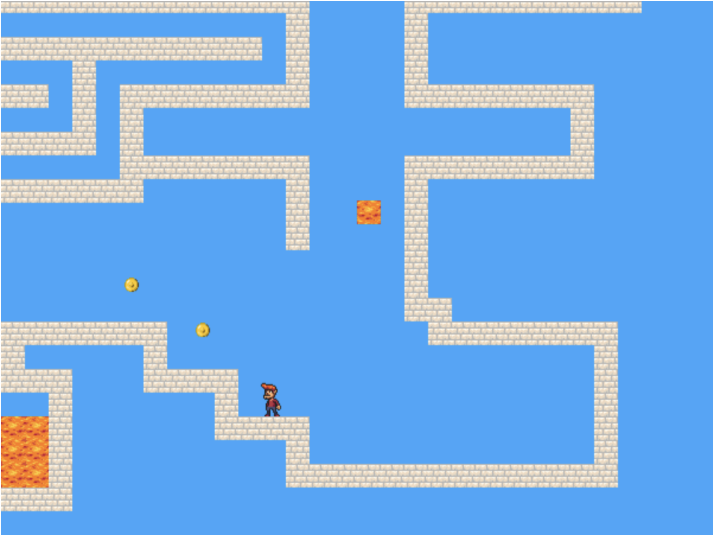

# Platform-Game
A platform game based on Dark Blue built using JavaScript

Use ⬅️ and ➡️ keys to move the player left and right

Use ⬆️ to make the player jump

The game is divided into levels and each level has a set number of coins.

Collecting all the coins on a certain level will take you to the next level.

Falling in lava causes the player to die and restart the level.

The game ends when all levels have been completed.
